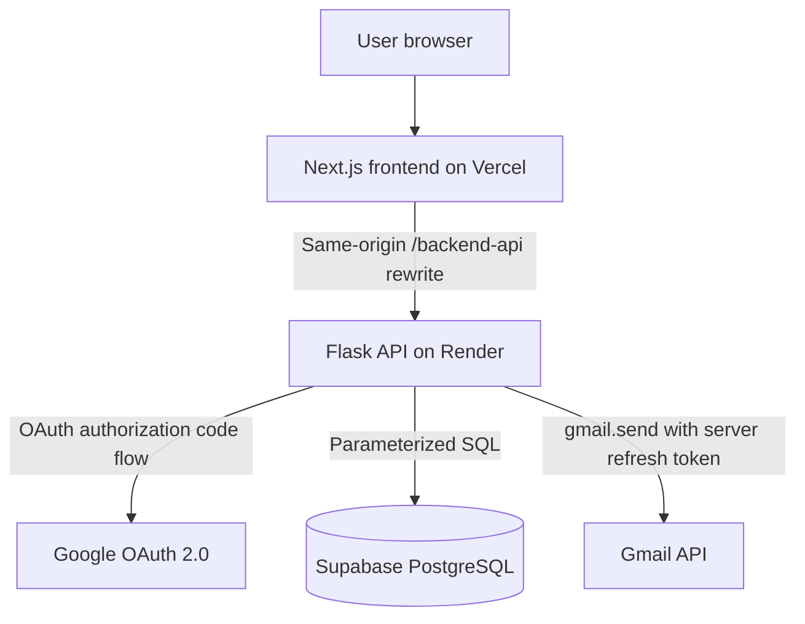

# Task Management Application

## Overview

TaskFlow is a small, production-oriented task management application. People sign in with Google, create tasks for registered users, see work they created or were assigned, and mark eligible tasks complete. The Flask API persists data in Supabase PostgreSQL and sends real assignment and completion notifications through the Gmail API.

The implementation intentionally uses direct, readable code and a small dependency set so each request can be explained during an interview.

## Features

- Google OAuth 2.0 sign-in with verified Google/Gmail accounts
- Automatic user creation/update after a successful login
- Task creation and assignment to registered users
- All, assigned, created, pending, and completed task views
- Completion by either the creator or assignee
- Gmail API notifications for assignment and completion
- Supabase PostgreSQL schema with ordered SQL migrations
- Responsive Next.js and TypeScript interface
- Validation, authorization, safe errors, CORS, origin checks, and secure production cookies
- Backend tests with Gmail mocked at the service boundary

## Architecture



- **Next.js** renders login, task form, filters, task cards, and user feedback. Its rewrite proxies `/backend-api/*` to Flask so browsers use a reliable first-party session cookie.
- **Flask** is the security boundary. It identifies the user from the signed session cookie, validates input, applies authorization, persists tasks, and requests emails.
- **Supabase** provides hosted PostgreSQL. The app connects with a server-only PostgreSQL URL; no database key is exposed to the browser.
- **Google OAuth** authenticates each app user. OAuth access tokens are used only during the callback and are not stored.
- **Gmail API** sends notifications from one application-owner mailbox using a server-only refresh token.

## Authentication Flow

1. The browser follows `GET /backend-api/auth/google` on the frontend origin; Next.js rewrites it to Flask's `GET /api/auth/google`.
2. Authlib creates an OAuth state value in the signed, HTTP-only session and redirects to Google.
3. Google returns an authorization code to the frontend's `/backend-api/auth/google/callback`, which is rewritten to Flask's callback.
4. Flask exchanges the code, validates the OpenID Connect response and verified email, then upserts the user by Google subject.
5. Flask stores only the internal user ID in its signed session cookie and redirects to the dashboard.
6. The frontend sends future requests through the same-origin rewrite. Flask loads the current user from the signed session; it never accepts a caller-supplied creator ID.

In production the cookie is `Secure`, `HttpOnly`, and `SameSite=Lax`. Keeping browser traffic on the Vercel origin avoids unreliable third-party cookies. CORS still permits only `FRONTEND_URL`, and JSON mutation requests are checked against the same origin.

## Task Flow

```text
Creator submits task
  -> Flask authenticates and validates
  -> PostgreSQL commits the task
  -> Gmail notifies the assignee (failure is logged, task remains saved)
  -> Creator/assignee loads the task
  -> Either eligible user completes it
  -> PostgreSQL atomically changes pending to completed
  -> Gmail notifies the creator
```

The creator can edit a pending task through the API; reassignment emails the new assignee. Only the creator and assignee can view or complete it. Other users receive `403`.

## Database Schema

Migrations live in [migrations](./migrations) and are ordered:

1. `001_create_users.sql` creates users with unique Google ID and email.
2. `002_create_tasks.sql` creates tasks with creator/assignee foreign keys and status checks.
3. `003_add_indexes.sql` indexes ownership, assignment, status, and ordering fields.

`users.id` and `tasks.id` are UUIDs generated by PostgreSQL. A task references `users.id` through both `created_by` and `assigned_to`. Status is constrained to `pending` or `completed`; timestamps use timezone-aware PostgreSQL values.

## API Documentation

All endpoints except health and the OAuth entry/callback require the signed session cookie.

| Method | Endpoint | Purpose |
|---|---|---|
| GET | `/api/health` | Process health check |
| GET | `/api/health/database` | Database connectivity check |
| GET | `/api/auth/google` | Start Google login |
| GET | `/api/auth/google/callback` | OAuth callback |
| POST | `/api/auth/logout` | Clear session |
| GET | `/api/users/me` | Current user |
| GET | `/api/users` | Registered assignment choices |
| POST | `/api/tasks` | Create and assign a task |
| GET | `/api/tasks?scope=&status=` | List related tasks; optional `created|assigned` and `pending|completed` filters |
| GET | `/api/tasks/:id` | Get one related task |
| PATCH | `/api/tasks/:id` | Creator edits a pending task |
| POST | `/api/tasks/:id/complete` | Creator or assignee completes a pending task |

Create request:

```json
{
  "title": "Prepare launch brief",
  "description": "Include audience, timeline, and owners.",
  "assigned_to": "registered-user-uuid"
}
```

Successful create responses use `201` and include `task` plus `email_sent`. Email failure does not roll back committed task data. Errors consistently return `{"error": "safe message"}` with `400`, `401`, `403`, `404`, `409`, `413`, `415`, or `500` as appropriate.

## Local Setup

Requirements: Node.js 20.19+ (or 22.13+), npm 10+, Python 3.11+ (3.12 recommended), and a Supabase project.

### 1. Database

Create a Supabase project. In **Project Settings → Database**, copy a PostgreSQL connection string. Prefer the session pooler string when your local network does not support IPv6. Replace its password placeholder.

Open Supabase **SQL Editor** and run the three files in `migrations/` in numeric order. They are idempotent and can also be run with `psql`:

```bash
psql "$DATABASE_URL" -f migrations/001_create_users.sql
psql "$DATABASE_URL" -f migrations/002_create_tasks.sql
psql "$DATABASE_URL" -f migrations/003_add_indexes.sql
```

Supabase Auth is not used. Flask owns a single, understandable Google OAuth flow and writes application users directly to PostgreSQL.

### 2. Backend

```bash
cd backend
python -m venv .venv
# Windows PowerShell:
.venv\Scripts\Activate.ps1
# macOS/Linux:
# source .venv/bin/activate
pip install -r requirements.txt
copy .env.example .env
python run.py
```

On macOS/Linux use `cp .env.example .env`. Fill the values described below. Flask listens on `http://localhost:5000`.

### 3. Frontend

```bash
cd frontend
npm install
copy .env.example .env.local
npm run dev
```

Use `cp` on macOS/Linux. Open `http://localhost:3000`.

## Environment Variables

Backend (`backend/.env`):

| Variable | Meaning |
|---|---|
| `DATABASE_URL` | Supabase PostgreSQL connection string; server only |
| `GOOGLE_CLIENT_ID` | Google OAuth web client ID |
| `GOOGLE_CLIENT_SECRET` | Google OAuth web client secret |
| `GOOGLE_REDIRECT_URI` | Exact Flask callback URL |
| `GMAIL_SENDER` | Mailbox authorized to send notifications |
| `GMAIL_REFRESH_TOKEN` | Offline Gmail authorization for that sender |
| `SECRET_KEY` | Long random value used to sign sessions |
| `FRONTEND_URL` | Exact allowed frontend origin, without trailing slash |
| `SESSION_COOKIE_SECURE` | `false` locally; `true` on HTTPS production |

Frontend (`frontend/.env.local`, server/build environment only):

| Variable | Meaning |
|---|---|
| `BACKEND_URL` | Flask origin used by the server-side Next.js rewrite, without trailing slash |

Generate `SECRET_KEY` with a password manager or `python -c "import secrets; print(secrets.token_urlsafe(48))"`. Never expose backend values through a `NEXT_PUBLIC_` variable.

## Google OAuth Setup

1. Create or select a project in Google Cloud Console.
2. Open **Google Auth Platform**, configure the app name, support email, audience, and developer contact.
3. For an external app in testing, add every person who must sign in under **Test users**.
4. Create an **OAuth client ID → Web application**.
5. Add `http://localhost:3000` as a local authorized JavaScript origin.
6. Add `http://localhost:3000/backend-api/auth/google/callback` as a local authorized redirect URI.
7. Add the final Vercel origin and `https://your-app.vercel.app/backend-api/auth/google/callback` for production.
8. Copy the client ID and secret to backend environment variables.
9. Set backend `GOOGLE_REDIRECT_URI=http://localhost:3000/backend-api/auth/google/callback` locally. Keep the login scopes at `openid email profile`; Gmail authorization is performed once for the sender as described below.

The redirect URI in Google Cloud and `GOOGLE_REDIRECT_URI` must match exactly, including scheme and path.

## Gmail Setup

1. In the same Google Cloud project, enable **Gmail API**.
2. Add the sensitive scope `https://www.googleapis.com/auth/gmail.send` to the OAuth consent configuration.
3. Choose the Gmail or Google Workspace mailbox that will send application notifications and set it as `GMAIL_SENDER`.
4. Obtain offline consent for that mailbox. A practical setup route is Google OAuth 2.0 Playground: open its settings, enable **Use your own OAuth credentials**, enter the web client ID/secret, authorize only `https://www.googleapis.com/auth/gmail.send`, exchange the code, and copy the refresh token.
5. Store the token only as `GMAIL_REFRESH_TOKEN` in backend secrets. Do not put it in Supabase or the frontend.

Google may issue a refresh token only on the first offline consent. If none is returned, revoke the app under the sender account's Google security settings and authorize again with offline access. An external app in testing can have refresh-token lifetime limitations; publish/verify the consent screen as required for production. Google Workspace administrators may also need to allow the scope.

The backend builds a MIME message and calls `users.messages.send`. Automated tests replace the service and never send mail. A runtime Gmail failure is logged after the database transaction, and the API returns `email_sent: false`.

## Testing

```bash
cd backend
pytest -q

cd ../frontend
npm run lint
npm run typecheck
npm run build
```

Backend tests cover health, authentication protection, valid/invalid creation, assignment/reassignment, retrieval isolation, completion, repeat completion, authorization, notification triggers, and email-failure isolation.

## Deployment

### Backend on Render

1. Push the repository to GitHub and create a Render Blueprint from `render.yaml`, or create a Python web service with root directory `backend`.
2. Build command: `pip install -r requirements.txt`.
3. Start command: `gunicorn run:app`.
4. Add every backend environment variable. Use the public Render URL for `GOOGLE_REDIRECT_URI`, the Vercel URL for `FRONTEND_URL`, and keep `SESSION_COOKIE_SECURE=true`.
5. Run migrations against the production Supabase database before traffic.
6. Confirm `/api/health` and `/api/health/database`.

### Frontend on Vercel

1. Import the GitHub repository.
2. Set root directory to `frontend`; Vercel detects Next.js.
3. Set the server-side `BACKEND_URL` to the HTTPS Render origin.
4. Deploy, then set the final Vercel URL as Render's `FRONTEND_URL` and `GOOGLE_REDIRECT_URI` to the Vercel `/backend-api/auth/google/callback` URL. Restart the API.

Finally update the Google OAuth client with the production frontend origin and backend callback. Verify login with two registered users, assignment email delivery, completion email delivery, database status, and forbidden access from an unrelated account.

## Live Demo

Not deployed yet. A real URL should be added here only after external Supabase, Google, Render, and Vercel credentials are configured and the end-to-end production checklist has passed.

## Project Structure

```text
.
├── backend/
│   ├── app/
│   │   ├── __init__.py       # Flask configuration and security boundary
│   │   ├── database.py       # Parameterized PostgreSQL operations
│   │   ├── email_service.py  # Gmail API messages and failure isolation
│   │   └── routes.py         # OAuth, users, and task REST endpoints
│   ├── tests/                # API and authorization tests
│   ├── .env.example
│   ├── Procfile
│   ├── requirements.txt
│   └── run.py
├── frontend/
│   ├── app/                  # Next.js routes, dashboard, and styles
│   ├── lib/api.ts            # Typed credentialed API helper
│   ├── .env.example
│   └── package.json
├── migrations/               # Reproducible Supabase SQL schema
├── render.yaml
└── README.md
```

## Security Notes

- Secrets, Google tokens, and database credentials remain on the backend.
- Login access tokens are not stored; the signed session contains only the internal user ID.
- The API derives `created_by` from that session and checks relationships for every task operation.
- SQL values use psycopg parameters.
- Production CORS uses one exact frontend origin; mutation requests require JSON and reject a foreign `Origin`.
- Cookies are HTTP-only, `SameSite=Lax`, and secure in production. The Next.js rewrite keeps browser requests first-party; HTTPS is terminated by Vercel and Render.
- Request bodies are capped at 32 KiB and field lengths are validated in both API and database constraints.
- Gmail errors are logged without including tokens and cannot roll back or corrupt a committed task.

For higher-scale production, move email delivery to a durable job queue and use a centralized server-side session store. Those additions are intentionally omitted from this assignment to keep the core flow understandable.

## Interview Explanation

Study these decisions:

- Why Flask—not the browser—owns OAuth, sessions, authorization, database access, and Gmail credentials.
- How OAuth state and the signed HTTP-only cookie prevent trusting a client-supplied identity.
- Why task creation commits before email delivery and returns `email_sent`.
- How the SQL conditions enforce ownership/assignment again during mutations, reducing race risks.
- Why the repository uses direct psycopg functions and three migrations instead of a larger ORM/migration framework.
- How CORS, `Origin` checks, JSON-only mutations, field validation, and parameterized SQL cover the main threats for this scope.
